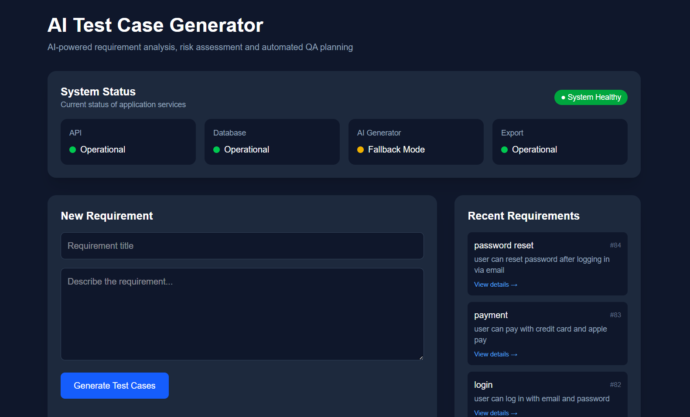
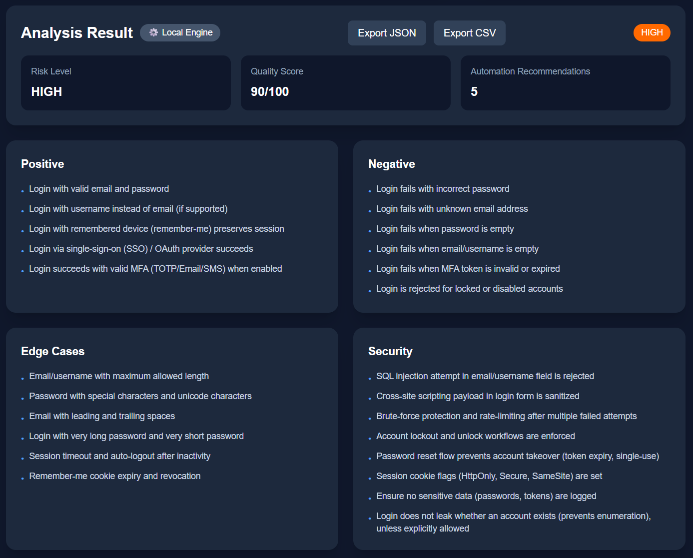
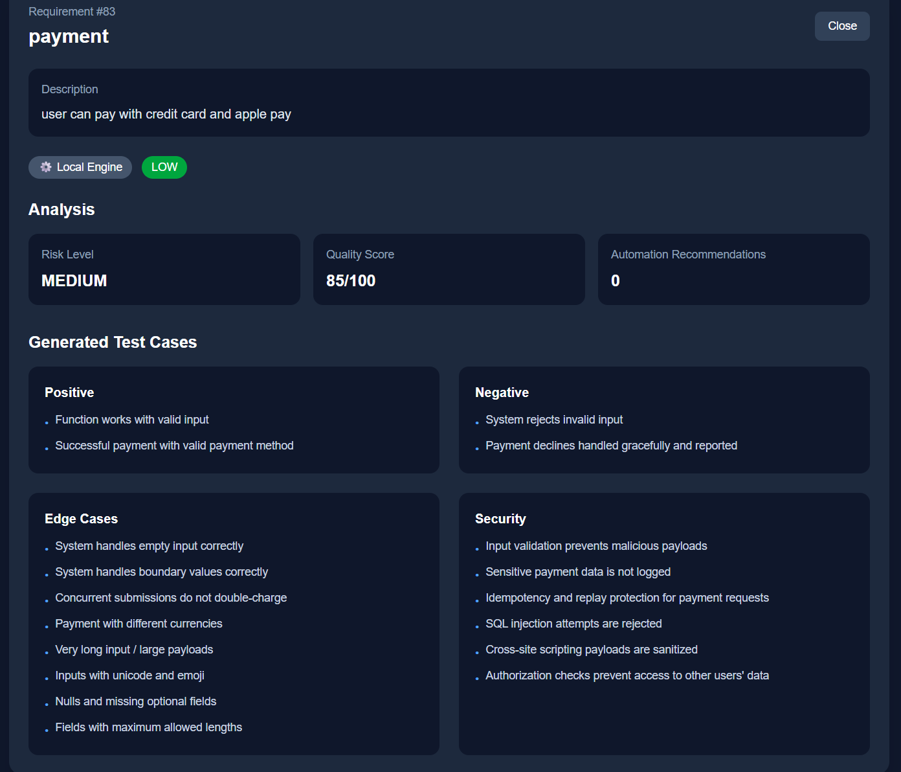
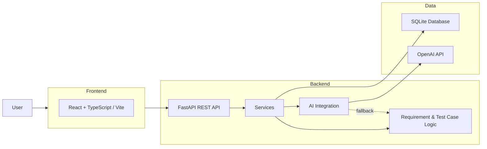

# AI Test Case Generator

A full-stack application for automatically generating and analyzing software test cases from natural-language requirements.

The application combines rule-based test generation with OpenAI-powered analysis and provides a fallback mechanism when the AI service is unavailable.

It allows users to enter software requirements, generate categorized test cases, analyze their priority and risk, and export the results as JSON or CSV.


## Features

- Generate test cases from natural-language software requirements
- OpenAI-powered test case generation
- Rule-based fallback when the AI service is unavailable
- Automatic requirement analysis
- Priority and risk assessment
- Quality score evaluation
- Recommendations for test automation
- Categorization of test cases:
  - Positive cases
  - Negative cases
  - Edge cases
  - Security cases
- Requirement history
- JSON and CSV export
- REST API with FastAPI
- Interactive API documentation with Swagger UI
- Health/status endpoint for application monitoring
- Automated backend tests with pytest
- Automated frontend build verification
- CI pipeline with GitHub Actions
- React-based web interface


## Screenshots

### Test Case Generation



### Requirement Analysis



### Requirement History




## Tech Stack

### Backend

- Python
- FastAPI
- SQLAlchemy
- SQLite
- Pydantic
- pytest

### Frontend

- React
- TypeScript
- Vite
- Tailwind CSS

### AI

- OpenAI API
- Rule-based fallback engine

### DevOps

- Git
- GitHub Actions
- Continuous Integration (CI)


## Architecture

The application is divided into a frontend and backend.

The backend handles requirement processing, test case generation, analysis, persistence and exports.

The frontend communicates with the backend through REST endpoints and provides the user interface for creating requirements, viewing generated test cases, analyzing results and exporting them.




## How It Works

1. The user enters a software requirement.
2. The backend analyzes the requirement.
3. The application attempts to generate test cases using the OpenAI API.
4. If the AI service is unavailable, the rule-based fallback engine is used.
5. Test cases are categorized into positive, negative, edge and security cases.
6. The requirement is analyzed for priority, risk and test automation recommendations.
7. The generated result is stored in the database.
8. The frontend displays the analysis and generated test cases.
9. Results can be exported as JSON or CSV.


## Optional AI Integration

The application supports optional OpenAI integration for enhanced natural-language test case generation.

To enable the AI integration, create a `.env` file in the project root and add your API key:

OPENAI_API_KEY=your_api_key

The OpenAI API is optional. If no API key is configured, the API is unavailable, or the account has no available credits, the application automatically falls back to the built-in rule-based test generation engine.

The frontend indicates whether the generated result was produced using the OpenAI integration or the local fallback engine.

## Project Structure

```text
ai-testcase-generator/
├── .github/
│   └── workflows/
│       └── ci.yml
│
├── backend/
│   ├── app/
│   │   ├── api/
│   │   ├── services/
│   │   ├── database.py
│   │   ├── main.py
│   │   ├── models.py
│   │   ├── schemas.py
│   │   └── ...
│   │
│   ├── tests/
│   ├── pytest.ini
│   └── requirements.txt
│
├── frontend/
│   ├── src/
│   │   ├── components/
│   │   ├── services/
│   │   ├── types/
│   │   └── ...
│   ├── public/
│   ├── package.json
│   └── package-lock.json
│
├── .env
├── .gitignore
├── README.md
└── ...
```


## Setup

### Prerequisites

- Python 3.12+
- Node.js 20+
- npm

### Clone the repository

```bash
git clone https://github.com/Haase123/ai-testcase-generator.git
cd ai-testcase-generator
```

### Backend

Create and activate a virtual enviroment:

```bash
python -m venv .venv
```

Activate the virtual enviroment and install the backend dependencies:

```bash
cd backend
pip install -r requirements.txt
```

Start the backend:

```bash
uvicorn app.main:app --reload
```

The API will be available at:

http://127.0.0.1:8000

Interactive API documentation is available at:

http://127.0.0.1:8000/docs

### Frontend

Open a second terminal and navigate to the frontend:

```bash
cd frontend
npm install
npm run dev
```

The frontend will be available at the URL shown by Vite, usually:

http://localhost:5173


## Testing

The backend is tested using 'pytest'.

To run the test suite:

```bash
cd backend
pytest
```

The tests cover core application functionality including:

- Test case generation
- Requirement analysis
- API endpoints
- AI/fallback behavior
- Error handling
- Data export
- Status/health checks


## Continous Integration

The project uses GitHub Actions for continuous integration.

On every push to the `main` branch and on pull requests, the CI pipeline:

1. Installs the required Python dependencies.
2. Runs the backend test suite with `pytest`.
3. Installs the frontend dependencies.
4. Builds the React frontend.

This helps ensure that changes do not introduce failing tests or frontend build errors.


## Future Improvements

Possible future improvements include:

- Support for additional AI providers and local language models
- Integration with external issue tracking and test management systems
- Persistent deployment using a production database
- Extended automated test coverage


## Author

Lasse Haase

Bachelor of Science in Computer Science

GitHub: Haase123